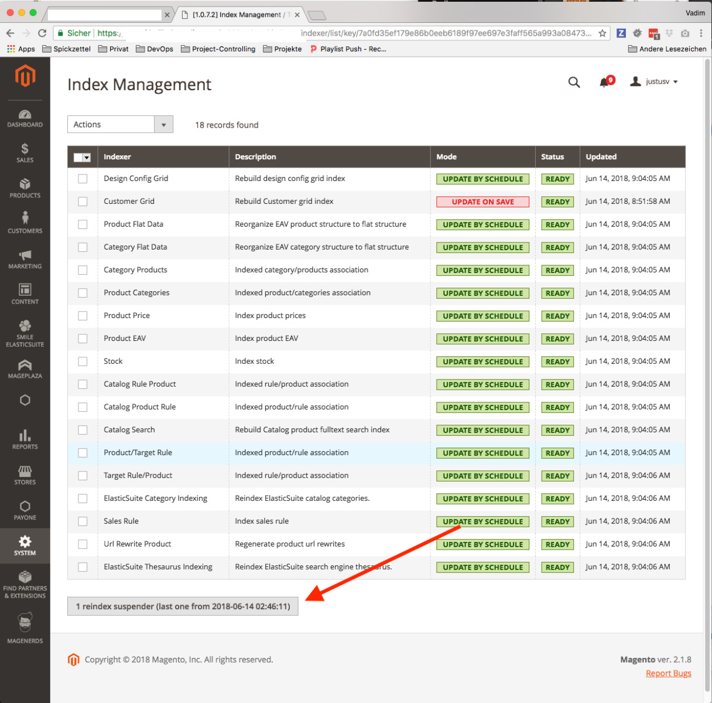

# TechDivision_IndexSuspender

This Magento 2 module suspends delta indexing while a full re-indexation is running. It also provides an interface in 
order to stop indexations within your custom implementations. 

```php
interface IndexSuspenderInterface
{
    /**
     * Suspends all related indexing processes.
     * If the request / cli process finishes, the suspender will be removed automatically.
     *
     * @return void
     */
    public function suspend();

    /**
     * Resumes all suspended indexing processes.
     *
     * @return void
     */
    public function resume();

    /**
     * Suspends all related indexing processes.
     * If the request / cli process finishes, the suspender will not be removed automatically.
     *
     * @param string $externalKey
     * @return void
     */
    public function suspendExternal($externalKey);

}
```

## Command line interface

This module provides some `bin/magento` commands in order to control and monitor the index suspending.

```bash
suspend
 suspend:index:list         List current index suspender ids
 suspend:index:resume-all   Resume all currently suspended indexes.
```

## Backend integration

You can see and unlock given indexer locks within the `Index Management` tab.


